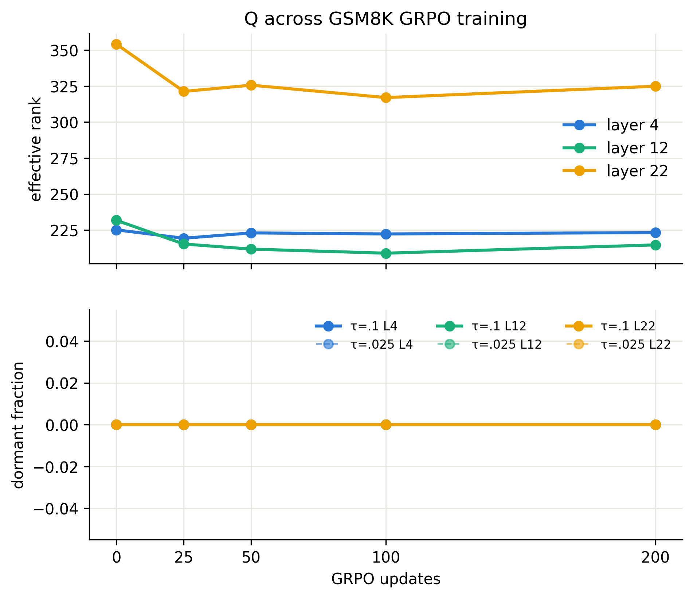
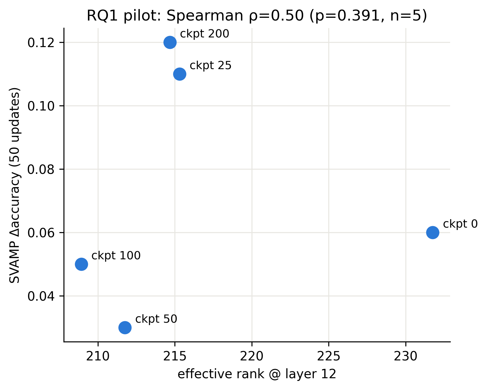
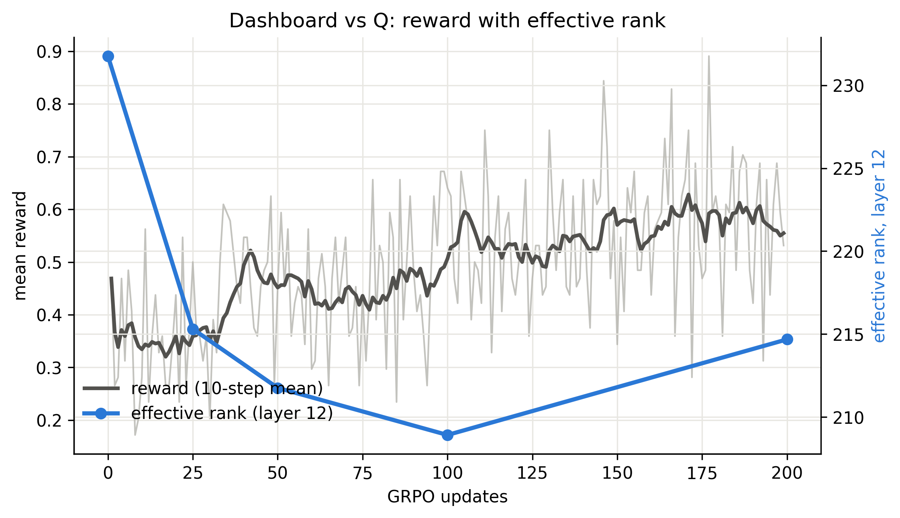

# EAAJ Pilot Windows RTX 4070 v2 实验报告

日期：2026-07-11  
运行目录：`eaaj-pilot/outputs/local_cuda_grpo_gsm8k_e9b0b52aab6c`  
最终结果提交：`5849874`（`origin/main`）

## 摘要

本实验研究一个很窄、但可操作的问题：在 GSM8K 上进行 Stage-A GRPO
训练时，模型内部表征指标 Q（主要是中间层 hidden-state effective rank）
能否预测同一 checkpoint 在固定 50 次更新预算下适应 SVAMP 的能力。

实验在 Qwen2.5-0.5B 的同一条训练轨迹上保存 0、25、50、100、200 五个
checkpoint；对每个 checkpoint 测量 Q，并从该 checkpoint 独立执行完全相同
的 50-update SVAMP GRPO 适应。主要结果变量是
`SVAMP accuracy after 50 updates - that checkpoint's own accuracy before adaptation`。

最重要的结果可以压缩成三句话：

1. v2 训练确实发生了。Stage-A 训练 reward 从前 25 步平均 0.354 上升到
   后 50 步约 0.578；33 个更新有效性窗口全部通过；权重组最大相对范数变化
   为 `6.06e-6`，明显高于无效 v1 的 `2.4e-8`。
2. 中、后层表征谱明显收缩。Layer 12 effective rank 从 231.76 降到
   214.68（-7.37%），Layer 22 从 354.19 降到 324.92（-8.26%）；2048
   probe sensitivity check 得到相同方向和相近幅度。
3. 但固定预算 SVAMP 适应性没有随训练单调恶化。五个 checkpoint 的
   50-update 提升分别为 +6、+11、+3、+5、+12 个百分点；最终 checkpoint
   反而取得最大提升。预注册主相关为
   `Spearman rho(erank_L12, SVAMP delta) = +0.50, p = 0.391, n = 5`。
   方向为正但证据很弱，不能据此声称 Q 已能预测适应性，更不能声称发生了
   “plasticity collapse”。

因此，最准确的结论是：**这条轨迹中出现了可重复测量的中后层谱压缩，
但没有观察到固定预算未来适应性的单调下降；“谱压缩等于塑性崩溃”没有被
本 pilot 证明。RQ1 仍未得到决定性答案。**

## 1. 研究问题与边界

项目的长期目标是预测 multi-stage RLVR 中后续阶段是否会 stall。若只能等到
Stage B 的 reward 已经停滞才发现问题，计算预算已经被消耗。项目希望找到
更早的内部信号 Q，例如 effective rank 或 dormant-neuron fraction。

本 pilot 回答的是 RQ1 的缩小版本：

> 同一条 GSM8K GRPO 训练轨迹上，checkpoint 时刻的 Q，是否与从该
> checkpoint 出发、固定 50 次 SVAMP 更新后的适应增量相关？

它不回答以下更宽的问题：

- 不证明 RLVR 是否普遍降低模型的学习能力。
- 不把 effective rank 当作“塑性”的唯一公认标量。
- 不比较不同模型规模、不同随机种子或不同任务家族。
- 不建立因果关系；五个点来自同一条训练轨迹。
- 不把 Windows CUDA、macOS CPU 等 execution strata 的数值混合统计。

## 2. 实验设计

### 2.1 总体流程

```text
Qwen2.5-0.5B base
       |
       | Stage A: GSM8K GRPO, 200 updates
       v
ckpt 0 / 25 / 50 / 100 / 200
       |                         |
       | Phase 2: measure Q      | Phase 3: identical SVAMP adaptation
       | on frozen probes        | 50 updates from each checkpoint
       v                         v
effective rank, dormant      before/after accuracy and learning curve
       \                         /
        \                       /
         Phase 4: Spearman association and plots
```

### 2.2 模型、数据与随机性

| 项目 | 设置 |
|---|---|
| 模型 | `Qwen/Qwen2.5-0.5B` |
| 模型 revision | `060db6499f32faf8b98477b0a26969ef7d8b9987` |
| 随机种子 | 42 |
| Stage-A 任务 | GSM8K，固定 512 train / 64 eval |
| Q probe | 固定 512 prompts；ckpt 0/200 另做 2048 sensitivity check |
| Stage-B 代理任务 | SVAMP，固定 256 train / 100 eval |
| checkpoint | 0、25、50、100、200 updates |
| reward | exact-answer binary reward |

所有数据索引在运行前冻结。每个 checkpoint 的 SVAMP 适应使用相同训练问题、
相同评估问题、相同随机种子和相同更新预算。这避免了“后期 checkpoint 恰好
遇到更难题目”的混淆。

### 2.3 Phase 1：Stage-A GSM8K GRPO

科学参数如下：

| 参数 | 值 |
|---|---:|
| updates | 200 |
| learning rate | `1e-6` |
| effective update geometry | micro-batch 4 x grad-accum 16 |
| generations | 8 |
| KL beta | 0 |
| temperature / top-p | 0.7 / 1.0 |
| prompt / completion cap | 512 / 512 tokens |
| evaluation | 每 25 步，固定 64 道 GSM8K |

开始训练前先运行 sparse-reward preflight：8 个 prompt 的每组 8 个 generation
全部存在 reward 方差，`has_grpo_signal=true`，因此 exact-answer reward 对
GRPO 不是全零信号。

Phase 1 还加入 update-effectiveness sentinel。每 25 步抽样比较参数相对变化；
若更新被低精度舍入吞掉，实验应在早期停止，而不是完成一个“看似正常、实际
未训练”的 run。

### 2.4 Phase 2：Q 的测量

对每个 checkpoint，在 eval mode 下对固定 probe 做 prompt-only forward。
测量 decoder block 4、12、22 的输出：

- **Effective rank（primary Q）**：对每个 prompt 的最后一个非 padding token
  hidden state 组成矩阵，中心化后做 SVD。若奇异值归一化为 `p_i`，则
  `erank = exp(-sum(p_i log p_i))`。值越高，表示激活谱更分散在多个方向；
  值下降表示表征更集中，但不能单独等同于“失去学习能力”。
- **Normalized erank、participation ratio、top-k variance share**：作为谱形状
  的辅助描述。
- **Centered / uncentered anisotropy**：区分共同均值偏移和真正方向性集中。
- **Dormant-neuron fraction**：MLP 单元平均绝对激活除以层内平均值，低于
  `tau=0.025` 或 `tau=0.1` 的单元比例。
- **Weight norm by group**：作为验证模型是否真实变化的廉价辅助指标。

Q 只在同一 stratum、相同 probe 大小内比较。512 样本会限制矩阵秩，因此
effective-rank 绝对值不能与 2048-probe 值直接比较；只能比较各自的相对变化。

### 2.5 Phase 3：固定预算 SVAMP 适应

从每个 Stage-A checkpoint 独立开始：

1. 在固定 100 道 SVAMP eval 上测 `acc_before`。
2. 使用固定 256 道 SVAMP train 做 50 次 GRPO 更新。
3. 在 10、20、30、40、50 步测同一 eval set。
4. 主结果为 `delta_acc = acc_after - acc_before`。

每个 checkpoint 使用完全相同的 LR、seed、sampling、optimizer 和有效 batch
geometry。使用每个 checkpoint 自己的 baseline，可以排除“起点更差所以看起来
提升更多”这一简单混淆，但不能完全排除 ceiling/headroom 效应。

### 2.6 Phase 4：主分析

预先指定：

- primary Q：`erank_L12`
- primary outcome：`svamp_delta`
- statistic：五个 checkpoint 上的 Spearman rank correlation

Spearman 只利用排序关系，适合样本极小且不假设线性关系的 pilot。其他层、
anisotropy 和不同 outcome 的相关均属于探索性分析，不能绕过主结果挑选最漂亮
的数字。

## 3. Windows execution stratum

### 3.1 硬件与软件

| 项目 | 实际环境 |
|---|---|
| OS | Windows 11 `10.0.22621` |
| GPU | NVIDIA GeForce RTX 4070 Laptop GPU，8 GiB |
| driver | 596.49 |
| Python | 3.13.14（conda-forge） |
| PyTorch | 2.11.0+cu128 |
| Transformers / TRL | 5.13.0 / 1.6.0 |
| Accelerate | 1.14.0 |
| bitsandbytes | 0.49.2 |
| NumPy / SciPy / pandas | 2.3.5 / 1.16.3 / 2.3.3 |

完整环境记录位于 `eaaj-pilot-win4070/env_records/`。

### 3.2 为什么采用 fp32 master + bf16 autocast

Windows v1 使用 pure-bf16 parameters 和 `lr=1e-6`。典型参数幅值下，单步更新
小于 bf16 可表示间隔，绝大多数更新被舍入为零。v1 虽跑完四个 phase，但
200 次 GSM8K 和 5 x 50 次 SVAMP 更新几乎没有改变模型：最大权重相对变化仅
`2.4e-8`，reward 基本不动，不能作为 RQ1 的科学证据。

v2 修复为：

- 参数 master copy 保持 float32，使小更新可以累积；
- 前向/反向用 bf16 autocast 控制显存和吞吐；
- optimizer 使用 `paged_adamw_8bit`，以便 fp32 master weights 和 optimizer
  states 能放入 8 GiB；
- gradient checkpointing 开启；
- micro-batch 4 x grad-accum 16 保持预注册的有效更新规模。

这是 execution profile 的变化，不改变数据、LR、reward、生成数、更新数、
checkpoint 或评估协议。

## 4. 运行中遇到的困难与解决办法

### 4.1 v1 静默无效：bf16 更新下溢

**现象**：流程无报错，文件齐全，但 reward、Q 和权重几乎不动。  
**诊断**：pure-bf16 parameter 在 `lr=1e-6` 下无法表示大多数 AdamW 增量。  
**解决**：建立独立 v2 stratum，改用 fp32 master + bf16 autocast，并加入
update-effectiveness sentinel。v1 保留为负面对照，不与 v2 混合。

这是整个运行中最重要的故障发现：它避免了把执行错误误读成“Q 与适应性无关”。

### 4.2 8 GiB 显存与 probe 记账异常

v2 full-geometry probe 成功完成一整步，耗时 86.45 秒；但 PyTorch 报告
10.809 GiB peak reserved，高于机器物理显存和预设 7.3 GiB gate。Windows
WDDM、paged optimizer 和 allocator 的统计口径使该数字不能按物理驻留显存
直接解释。实际训练能够运行，`nvidia-smi` 也显示接近但未持续越过物理上限。

处理方式是保留该 deviation 和原始 telemetry，不把它伪装成通过阈值。后续
若稳定复现 OOM，预定 ladder 是先释放桌面显存，再改为 micro-batch 2 x
grad-accum 32；本次没有修改科学参数。

### 4.3 Phase 1 断点保存与 bitsandbytes 状态损坏

Phase 1 先后在 25、50、75 步附近中断：

- step 25 checkpoint 缺少可恢复的 `trainer_state.json`，optimizer 状态不完整；
- step 50 保存 `paged_adamw_8bit` optimizer state 时挂起/损坏；
- step 75 恢复时出现 `KeyError: TrainerControl`。

解决过程：

1. 保留已有模型 checkpoint，不重写用户产物。
2. 重建最低限度的 Trainer state、scheduler position 和 callback control metadata。
3. 对 `paged_adamw_8bit` 使用 `save_only_model=True`，避免 Windows 下再次保存
   不稳定的 optimizer state。
4. 从修复后的 checkpoint 继续，并用 sentinel 逐窗口验证更新仍有效。

**重要限制**：修复保住了模型参数和学习率调度位置，但 optimizer moments 与
RNG state 在这些恢复边界上不等同于一次完全不中断的运行。因此最终 v2 是一条
有效训练轨迹，但不是 bitwise-equivalent 的 uninterrupted trajectory。这个限制
可能影响 checkpoint 的精确位置和后续相关值，不能忽略。

### 4.4 GPU telemetry 停止时没有完整落盘

原 wrapper 使用长驻 `nvidia-smi -l 60 | Out-File`。PowerShell job 被停止时，
缓冲内容可能尚未刷新，导致 CSV 为空或缺行。

解决为每 60 秒单独执行一次 query，并用 `Add-Content` 立即追加。各 phase 的
CSV 随结果复制到 run 目录后提交。

### 4.5 Phase 3 ckpt-50 瞬时 OOM

第一次多-checkpoint Phase 3 运行中，ckpt-0 和 ckpt-25 已完成；ckpt-50 在
baseline eval 后、训练第一个 update 附近发生 CUDA OOM。当时没有可用的正式
trainer checkpoint，不能把部分 dashboard 直接接到新 run 上。

解决方式：

- 将不完整目录保留为本地
  `ckpt-50_oom_attempt_20260710_124220`，保留证据；
- 清空 GPU 后，在新的独立进程中以完全相同的预注册 geometry 从 ckpt-50
  重新开始；
- 重跑顺利完成，未触发 micro-batch fallback；
- 之后在新进程继续 ckpt-100 和 ckpt-200。

这次处理没有混合两次 attempt 的结果，也没有修改 LR、seed、数据或预算。

## 5. 实验结果

### 5.1 Stage-A 训练信号

去除恢复产生的重复记录后，200 个训练 step 的 reward 分段均值为：

| Stage-A steps | mean exact-answer reward |
|---:|---:|
| 1-25 | 0.3544 |
| 26-50 | 0.4425 |
| 51-100 | 0.4616 |
| 101-150 | 0.5375 |
| 151-200 | 0.5781 |

这条曲线说明 v2 不再是 v1 的 no-op；模型在训练采样分布上的 exact-answer
reward 明显提高。

固定 64 道 GSM8K eval 的准确率为：

| ckpt | accuracy |
|---:|---:|
| 0 | 0.3594 |
| 25 | 0.4688 |
| 50 | 0.4375 |
| 75 | 0.4219 |
| 100 | 0.4688 |
| 125 | 0.4531 |
| 150 | 0.4219 |
| 175 | 0.4688 |
| 200 | 0.4219 |

训练 reward 上升，但小型 held-out eval 不单调。64 道题中一题即 1.56 个
百分点，因此这些波动不应被解释为清晰的泛化趋势。它至少说明“训练 reward
上升”与“held-out GSM8K 单调提高”不是同一件事。

### 5.2 更新有效性与权重变化

- Phase 1：8 个 25-step sentinel window 全部 `updates_effective=true`。
- Phase 3：5 个 checkpoint x 5 个 10-step window 全部有效。
- 总计：33/33 window 通过。
- ckpt-0 到 ckpt-200，74 个权重组中最大相对 L2-norm 变化为 `6.06e-6`；
  均值 `3.95e-7`，中位数 `1.87e-7`。

最大变化出现在 embedding（`6.06e-6`），其次是 layer-0 norm
（`3.39e-6`）。这不是“大幅改写模型”，但足以证明更新没有被精度全部吞掉，
并超过 v1 两个数量级以上。

### 5.3 Q：中后层 effective rank 下降

512-probe 结果：

| ckpt | erank L4 | vs ckpt0 | erank L12 | vs ckpt0 | erank L22 | vs ckpt0 |
|---:|---:|---:|---:|---:|---:|---:|
| 0 | 225.14 | 0.00% | 231.76 | 0.00% | 354.19 | 0.00% |
| 25 | 219.31 | -2.59% | 215.31 | -7.10% | 321.31 | -9.28% |
| 50 | 223.01 | -0.95% | 211.76 | -8.63% | 325.67 | -8.05% |
| 100 | 222.29 | -1.27% | 208.92 | -9.85% | 317.03 | -10.49% |
| 200 | 223.24 | -0.84% | 214.68 | -7.37% | 324.92 | -8.26% |

图形见：



观察：

- Layer 4 基本稳定，只在 ckpt-25 有一次较明显下降。
- Layer 12 和 22 很早就下降，ckpt-100 最低，ckpt-200 有部分回升。
- 这更像“中后层谱先收缩、后轻微回弹”，不是持续线性坍缩。
- 2048-probe sensitivity check 从 ckpt-0 到 200 得到 L4 -1.03%、L12
  -7.22%、L22 -7.71%，说明主要方向不是 512-probe rank cap 的假象。
- 所有 checkpoint、三层、两个 tau 的 dormant fraction 都是 0。准确含义是
  “按当前归一化和阈值没有单元被判定 dormant”，不是模型不存在任何低活跃
  单元。该指标在本设置下没有方差，因此无法预测 outcome。

### 5.4 固定预算 SVAMP 适应结果

| Stage-A ckpt | SVAMP before | after 50 updates | delta |
|---:|---:|---:|---:|
| 0 | 0.53 | 0.59 | +0.06 |
| 25 | 0.51 | 0.62 | +0.11 |
| 50 | 0.56 | 0.59 | +0.03 |
| 100 | 0.55 | 0.60 | +0.05 |
| 200 | 0.54 | 0.66 | +0.12 |

逐 10 步曲线为：

| ckpt | before | step 10 | 20 | 30 | 40 | 50 |
|---:|---:|---:|---:|---:|---:|---:|
| 0 | 0.53 | 0.53 | 0.53 | 0.54 | 0.52 | 0.59 |
| 25 | 0.51 | 0.56 | 0.58 | 0.64 | 0.64 | 0.62 |
| 50 | 0.56 | 0.59 | 0.59 | 0.64 | 0.58 | 0.59 |
| 100 | 0.55 | 0.60 | 0.62 | 0.59 | 0.59 | 0.60 |
| 200 | 0.54 | 0.59 | 0.64 | 0.65 | 0.65 | 0.66 |

关键点：

- 五个 checkpoint 的 endpoint delta 全为正。
- ckpt-200 没有显示 stall；它的曲线最稳定，最终提升最大。
- ckpt-25 同样适应良好；ckpt-50 和 100 较弱。
- 曲线具有明显非单调和评估噪声，尤其 ckpt-0、50、100。只看单个 endpoint
  会丢失信息；未来应预注册 curve AUC 或 time-to-threshold 作为次要 outcome。
- 100 道 eval 在 accuracy 约 0.5 时，单次 binomial standard error 约 5 个
  百分点。3-6pp 的小 delta 很容易受评估噪声影响，11-12pp 更值得关注，但
  本次仍只有一个 adaptation seed。

### 5.5 主相关分析

主结果：

```text
Spearman rho(erank_L12, svamp_delta) = +0.50
p = 0.391
n = 5 checkpoints
```



正确解释：

- 正号表示在这五个点的排序中，较高 L12 erank 倾向与较高 fixed-budget
  delta 同向；这与“更高 Q 可能代表更强适应性”的方向一致。
- `p=0.391` 表明该排序远不足以排除随机波动。不能写成“发现正相关”。
- n=5 的统计功效极低；而且五个 checkpoint 来自同一条轨迹，并非独立样本，
  传统 p 值只能作为描述性参考。
- 具体点也不支持简单单调故事：L12 erank 在 ckpt-200 仍比 base 低 7.37%，
  但 ckpt-200 的 SVAMP delta 反而最大。

探索性结果中，L4 erank 与 delta 的 rho 为 +0.10，L22 为 -0.10；centered
anisotropy 在 L12/L22 与 delta 的 rho 为 +0.60。由于同时查看了多个层、多个
Q 和多个 outcome，且没有相应显著性/多重比较校正，这些数字只能用于设计下一
轮实验，不能作为发现。

Reward 与 Q 的并列图：



## 6. 如何准确理解这些结果

### 6.1 可以比较有把握地说什么

1. **v2 数值路径有效。** fp32 master 修复了 v1 的 bf16 更新下溢；reward、
   权重和 Q 都显示模型真实变化。
2. **Stage A 伴随中后层表征谱压缩。** L12/L22 effective rank 下降约 7-10%，
   并被 2048-probe sensitivity check 支持。
3. **这条轨迹没有出现清晰的 future-adaptation collapse。** 所有 checkpoint
   在 50 步 SVAMP 后均有正提升，ckpt-200 还是最佳 endpoint。
4. **Dormant fraction 在当前阈值下没有信息量。** 它全程为 0，无法作为这个
   模型/任务/阈值组合的早期预警器。

### 6.2 不能说什么

1. 不能说“Q 已成功预测 plasticity collapse”。主相关不显著，且实际没有
   出现明确 collapse outcome。
2. 不能说“effective rank 下降导致适应性下降”。本实验是观察同一训练轨迹，
   没有干预 Q，也没有因果识别。
3. 不能说“RLVR 不会伤害学习能力”。模型、任务、seed 和预算都太有限。
4. 不能把 `rho=0.50` 当作稳定 effect size。n=5 时一个点的排序就能大幅改变它。
5. 不能把 v1 的近零相关当作反证；v1 是数值 no-op。

### 6.3 最简洁的科学结论

> 在 Qwen2.5-0.5B 的单条 GSM8K GRPO 轨迹上，中后层 effective rank
> 明显下降，但固定 50-update SVAMP 适应性没有单调下降。主相关方向为正但
> 不显著。该 pilot 验证了测量与执行管线，也发现了表征谱变化；它尚未验证
> Q 是可靠的 stall predictor。

## 7. 主要限制与风险

### 7.1 样本量与非独立性

只有五个 checkpoint，而且来自同一训练轨迹。它们共享初始化、数据、早期
更新和随机过程，不能视作五个独立模型。Spearman p 值因此不应被过度形式化。

### 7.2 单 seed 与适应噪声

Stage A 和每个 Stage B adaptation 都只有 seed 42。GRPO rollout 和 100-question
eval 的噪声可能改变 checkpoint 排序。下一轮至少应重复 adaptation seeds，
最好也重复 Stage-A trajectories。

### 7.3 Stage-A 与 Stage-B 任务过近

GSM8K 与 SVAMP 都是文字数学题。Stage-A 训练可能直接迁移到 SVAMP，而不是只
改变“通用未来学习能力”。本 run 的 SVAMP before 仅在 0.51-0.56 间变化，
直接迁移没有像另一 stratum 那么强，但任务家族接近仍是核心限制。

### 7.4 outcome 评估方差较大

SVAMP eval 只有 100 题；单点标准误约 5pp。主 outcome 又是 before/after 之差。
固定同一题集降低了一部分配对噪声，但 3-6pp delta 仍不稳定。

### 7.5 Phase-1 恢复不是完整 optimizer-state resume

25/50/75 边界的修复没有恢复原始 optimizer moments 和 RNG state。v2 是有效的
训练轨迹，但其 checkpoint 不等价于理想的不间断 run。这是当前结果最重要的
工程性内部效度限制。

### 7.6 Windows 8-bit optimizer 是 execution deviation

`paged_adamw_8bit` 与 CPU/Colab 的 plain fp32 AdamW 不完全相同。stratum 内部
比较仍然成立，但不能把不同 stratum 的绝对 Q、reward 或相关值直接池化。

### 7.7 dormant threshold 不敏感

两个预设 tau 都产生常数 0。未来若更换 threshold，必须作为新分析预注册或
明确标为 exploratory，不能在本结果上事后调参直到出现相关。

## 8. 下一轮实验建议

按优先级排序：

1. **增加独立重复。** 至少 3 条 Stage-A seed；每个 checkpoint 至少 3 个
   Stage-B adaptation seed。置信区间会比继续堆更多 Q variants 更有价值。
2. **增加 checkpoint 密度。** 例如 0/12/25/50/75/100/150/200；但统计模型要
   显式处理 trajectory 内相关，而不是把点当独立样本。
3. **增加真正不同的 Stage-B task family。** 保留 SVAMP，同时加入 ProntoQA
   或其他非数学任务，区分 task transfer 与 general adaptability。
4. **提高 outcome 稳定性。** 扩大 eval set；预注册 accuracy-curve AUC、
   time-to-threshold、pass@k，endpoint delta 仍保留为 primary 或 co-primary。
5. **制造更有量程的 Stage-A 条件。** 更长训练或团队批准后的 LR/beta 对照，
   目标是让 Q 与 future-adaptation outcome 都跨越足够宽的范围，而不是只在
   小噪声内做相关。
6. **保留 sentinel。** 每个精度/optimizer profile 都先验证真实权重更新；这次
   v1 教训说明它应成为所有正式 run 的硬 gate。
7. **做完整 optimizer-state 的可恢复方案。** 若 bitsandbytes Windows state
   仍不可靠，应选择可稳定序列化的 optimizer/venue，或明确将每个 checkpoint
   作为独立、从科学 checkpoint 启动的后续实验，避免中途修复改变轨迹。

## 9. 计算成本与产物

| 阶段 | 实际 active wrapper time | 主要产物 |
|---|---:|---|
| probe | <5 min | VRAM/throughput telemetry |
| Phase 1 | 5.18 h（多次恢复合计） | checkpoints、dashboard、GSM8K eval、sentinel |
| Phase 2 | 3.9 min | 五个 Q metric JSON + 0/200 sensitivity |
| Phase 3 | 5.26 h（三次运行合计） | 五组 SVAMP curves、summaries、sentinels |
| Phase 4 | 1.3 min | results/spearman CSV、summary、三张图 |

active wrapper 合计约 10.5 小时，不含机器休眠、人工诊断和等待时间。

关键版本提交：

| commit | 内容 |
|---|---|
| `ac37e81` | Phase 1 产物和 Windows 恢复相关修复 |
| `61d56d0` | Phase 2 Q metrics |
| `4c63324` | Phase 3 adaptation 产物 |
| `5849874` | Phase 4 分析、图表和最终记录 |

## 10. 可审计产物索引

- 预注册 Windows 方案：`eaaj-pilot-win4070/WIN4070_EXPERIMENT_PLAN.md`
- 重跑指南：`eaaj-pilot-win4070/WIN4070_RERUN_GUIDE.md`
- v1 无效原因：`eaaj-pilot-win4070/WIN4070_RUN_ANALYSIS.md`
- 环境记录：`eaaj-pilot-win4070/env_records/`
- 实际 config/manifest：run 目录中的 `config.json`、`manifest.json`
- Stage-A dashboard/eval：`dashboard.jsonl`、`gsm8k_eval.jsonl`
- 更新有效性：`update_sentinel.jsonl` 及每个 adaptation 子目录同名文件
- Q measurements：`measurements/metrics_ckpt*.json`
- SVAMP adaptation：`adaptation/ckpt-*/baseline.json`、
  `svamp_eval_curve.jsonl`、`summary.json`
- 最终表格：`analysis/results_table.csv`、`analysis/spearman_table.csv`
- 最终摘要：`analysis/analysis_summary.json`
- GPU telemetry 与 probe：`telemetry/`
- 计算账本与 deviations：`eaaj-pilot/compute_log.md`

## 结论

本次 Windows v2 最成功的部分不是获得了一个显著相关，而是把科学问题和执行
有效性分开了：v1 揭示了一个会产生假阴性的精度 bug，v2 证明训练和 Q 测量
真实工作，并观察到稳定的中后层 effective-rank 收缩。与此同时，固定预算
SVAMP outcome 没有显示后期 checkpoint stall，主相关也没有足够证据。

因此，本 run 应被定位为：**成功的端到端 feasibility pilot + 有价值的谱变化
观察 + 对“Q 可预测塑性崩溃”仍不确定的科学结果**。下一步最值得花预算的不是
继续解释这五个点，而是增加独立 seed、扩大/多样化 Stage-B task，并提高
outcome 的统计稳定性。
